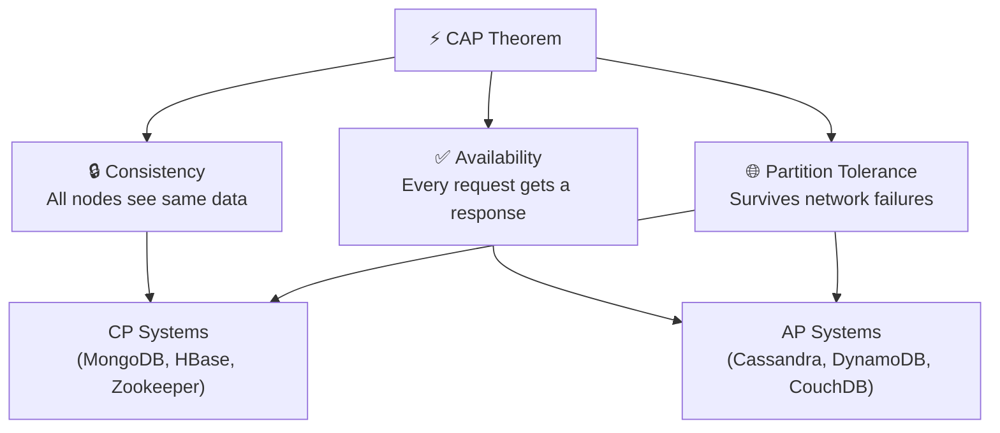

# CAP Theorem

The **CAP Theorem** is one of the most important ideas in distributed systems. It was formally proven by Eric Brewer in 2002.

:::info TL;DR
In a distributed system, you can only **guarantee 2 out of 3** properties at any given time:
- **C**onsistency
- **A**vailability
- **P**artition Tolerance
:::

---

## What Do the 3 Properties Mean?

### 🔒 Consistency (C)
Every read receives the **most recent write** — or an error. Every node in the system sees the same data at the same time.

> Think of it like a bank balance. If you deposit money and immediately check your balance, you should always see the updated amount — regardless of which server handled each request.

### ✅ Availability (A)
Every request receives a response — but it's **not guaranteed to be the most recent data**. The system never goes down.

> Think of it like a social media "like" count. If you're in a terrible network zone, you might see a slightly stale count — but the page still loads.

### 🌐 Partition Tolerance (P)
The system **continues operating** even when network packets are dropped or delayed between nodes (a "network partition").

> This is almost always a requirement in real distributed systems. Networks fail. You can't assume perfect communication.

---

## The Trade-off: You MUST Choose P in Practice

In real distributed systems, **network partitions will happen**. You can't avoid them. So in practice, the real choice is:

| Trade-off | Pick When... | Examples |
|---|---|---|
| **CP** (Consistency + Partition Tolerance) | Data accuracy is critical | HBase, Zookeeper, MongoDB (strict mode) |
| **AP** (Availability + Partition Tolerance) | Uptime is critical, stale data is okay | Cassandra, CouchDB, DynamoDB |

:::warning The "CA" Myth
**CA systems (Consistency + Availability)** technically require a perfectly reliable network — which doesn't exist in distributed systems. CA databases like traditional RDBMS can exist in *single-node* deployments, but not truly distributed ones.
:::

---

## Visualizing CAP

---

## Real-World Example: Two ATMs

Imagine two ATMs connected to the same bank, but their connection drops (network partition).

**Scenario**: You have $100. You withdraw $100 at ATM-1. Then you walk to ATM-2 and try to withdraw $100 again.

- **CP System** → ATM-2 **refuses** the transaction (returns error) until it syncs with ATM-1. *(Consistent, but unavailable during partition)*
- **AP System** → ATM-2 **allows** the transaction, temporarily letting you withdraw $100 twice. *(Available, but inconsistent — overdraft!)*

Banks usually prefer **CP** here. Stale data means real money loss.

---

## Beyond CAP: PACELC

CAP only describes behavior during a partition. **PACELC** extends it:

> Even when the system is running **normally** (no partition), there's a trade-off between **Latency** and **Consistency**.

| | During Partition | No Partition |
|---|---|---|
| **CAP** | C vs A | — |
| **PACELC** | C vs A | Latency vs Consistency |

---

## Key Takeaways

- ✅ You cannot have all 3 — choose based on your use case.
- ✅ Network partitions are unavoidable — design for CP or AP.
- ✅ Most modern databases let you **tune** this (e.g., Cassandra consistency levels).
- ✅ Real systems often **mix** strategies at different layers.
