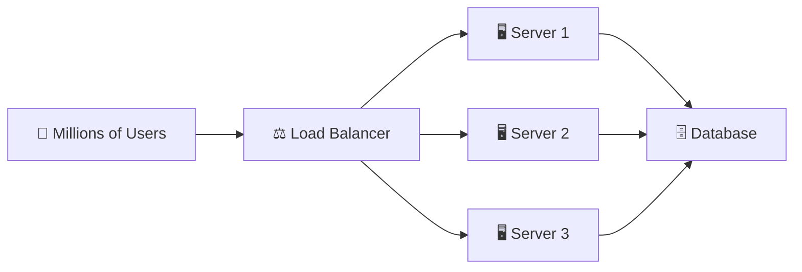
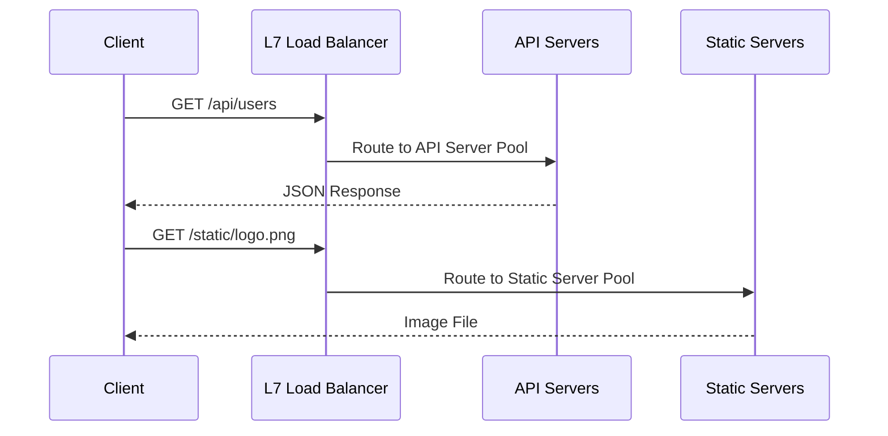

# Load Balancing

When millions of users hit your service simultaneously, **one server can't handle it**. Load balancing is the technique of distributing incoming traffic across a pool of servers to ensure no single server is overwhelmed.

:::info TL;DR
A load balancer is a **traffic cop** that sits in front of your servers and routes requests intelligently.
:::

---

## How It Works

The load balancer receives all incoming requests and forwards them to appropriate backend servers, then sends the server's response back to the client.

---

## Load Balancing Algorithms

| Algorithm | How It Works | Best For |
|---|---|---|
| **Round Robin** | Requests go to servers in sequence (1→2→3→1→2→3…) | Servers with equal capacity |
| **Least Connections** | Route to the server with fewest active connections | Long-lived connections (WebSockets) |
| **IP Hash** | Route based on client IP (same IP → same server) | Sessions that need sticky routing |
| **Weighted Round Robin** | More powerful servers get more traffic | Heterogeneous server pools |
| **Random** | Randomly pick a server | Simple, equally powerful servers |

---

## Layer 4 vs Layer 7 Load Balancing

### Layer 4 (Transport Layer)
- Operates on **TCP/UDP** level
- Routes based on **IP address and port**
- Very fast, but "dumb" — can't read request content
- Examples: AWS Network Load Balancer (NLB)

### Layer 7 (Application Layer)
- Operates on **HTTP/HTTPS** level
- Can route based on **URL, headers, cookies, query params**
- Smarter routing (e.g., `/api/*` → API servers, `/static/*` → CDN)
- Examples: AWS ALB, Nginx, HAProxy

---

## Health Checks

A load balancer constantly pings each server to check if it's alive. If Server 2 goes down:

1. ❌ Health check fails on Server 2
2. ⚡ Load balancer **removes** Server 2 from the rotation
3. 🔄 All traffic now goes to S1 and S3
4. 🩺 Server 2 recovers → LB adds it back

This is how services like Netflix achieve **99.99% uptime** even when individual servers fail.

---

## Sticky Sessions (Session Affinity)

By default, each request can go to a different server. But some apps store **session data in memory** (bad practice, but common). In that case, the same user must always hit the same server.

:::warning Problem with Sticky Sessions
If "sticky" Server 2 goes down, **all those users lose their sessions**. Sticky sessions fight against the purpose of load balancing. Prefer stateless servers + external session storage (Redis).
:::

---

## Real-World: How Netflix Does It

Netflix uses a combination:
- **AWS ALB** for HTTP traffic routing
- **Zuul** (their open-source gateway) for service-level load balancing
- **Eureka** for service discovery (which servers are alive?)
- **Ribbon** for client-side load balancing between microservices

---

## Key Takeaways

- ✅ Load balancing enables **horizontal scaling** — add more servers, not bigger servers.
- ✅ Prefer **Layer 7** for web apps (smarter routing), **Layer 4** for raw throughput.
- ✅ Health checks make your system **self-healing**.
- ✅ Avoid sticky sessions — use **Redis** for session storage instead.
- ✅ The load balancer itself can be a **single point of failure** — use a pair (Active/Passive).
