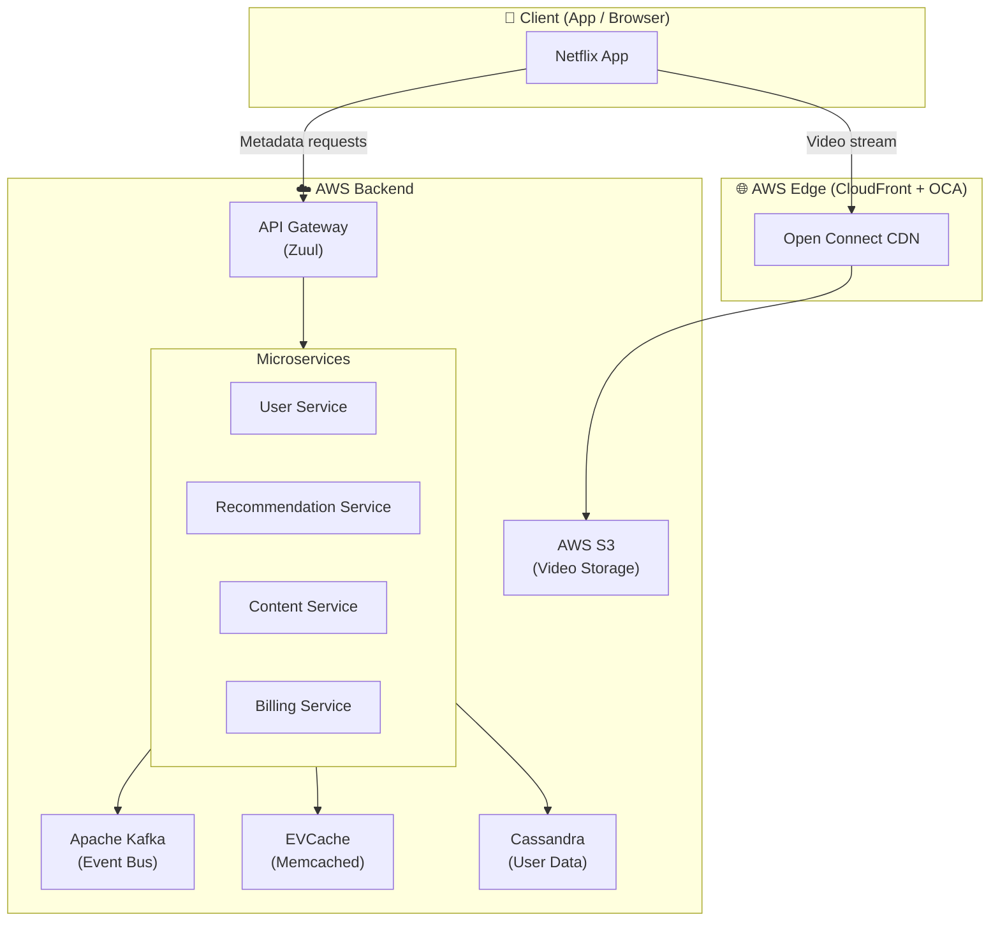
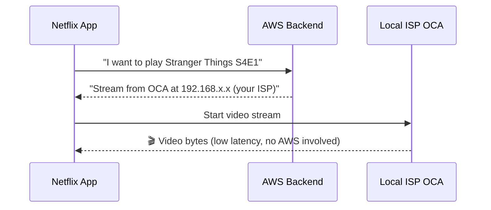
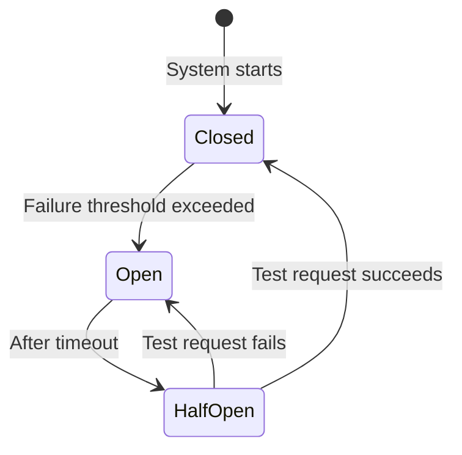

# Case Study: Netflix Architecture

Netflix serves **270 million subscribers** across 190 countries, streaming **1 billion+ hours** of video per day. Their architecture is one of the most referenced in system design discussions.

:::info Key Numbers (2024)
- 🌍 190+ countries
- 👤 270 million subscribers
- 📺 1 billion+ hours streamed per day
- ☁️ Runs entirely on **AWS**
- 🎬 ~15,000 microservices
:::

---

## High-Level Architecture

---

## The Two Sides of Netflix

Netflix's architecture has **two distinct data flows**:

### 1. 📋 Control Plane (Metadata)
Requests for user data, recommendations, search, and content metadata. These go through their **AWS backend**.

### 2. 🎬 Data Plane (Video)
Actual video streams. These **never go through AWS**. Instead, they flow through Netflix's own **Open Connect CDN** — servers Netflix places *inside ISPs and internet exchanges* globally.

---

## Key Technology Decisions

### Microservices (~15,000 services)
Netflix was one of the first companies to fully adopt microservices (2008 onwards). Each service:
- Owns its own database
- Is deployed independently
- Communicates via REST or Kafka events

### Open Connect CDN
Instead of relying on third-party CDNs, Netflix built its own. They ship physical servers called **Open Connect Appliances (OCAs)** directly to ISPs. The OCA stores the top 95% of streamed content locally. When you press Play:

### EVCache (Distributed Caching)
Netflix processes billions of requests and can't hit Cassandra every time. EVCache is their Memcached-based caching layer, replicated across AWS availability zones. Cache hit rates: **~99%**.

### Apache Kafka (Event Streaming)
All activity (plays, pauses, searches, ratings) is published to Kafka. This powers:
- Real-time **recommendation updates**
- **Analytics** pipelines
- **Billing** events
- **A/B testing** infrastructure

---

## Resilience Engineering

Netflix is famous for handling failures. They built **Chaos Engineering**.

### Chaos Monkey 🐒
A tool that **randomly kills production servers** during business hours. The philosophy: *"If it can fail, it will fail. So let's fail it on purpose when engineers are watching."*

### Hystrix (Circuit Breaker)
When a downstream service is slow or down, Hystrix **"opens the circuit"** and returns a cached/default response instead of waiting. This prevents cascading failures.

---

## Database Strategy

| Data Type | Database | Why |
|---|---|---|
| User profiles, watch history | **Cassandra** | High write throughput, geo-distributed |
| Billing data | **MySQL** (on RDS) | ACID transactions needed |
| Recommendations model | **Custom ML infra** | Real-time + batch hybrid |
| Movie metadata | **DynamoDB** | Fast key-value lookups |
| Session data | **EVCache (Memcached)** | Ultra-low latency |

---

## What I Learned From Netflix

1. **Separation of concerns at scale** — video traffic and API traffic are completely decoupled.
2. **Build for failure** — Chaos Engineering is now an industry practice, not just Netflix's quirk.
3. **CDN strategy matters more than application logic** for media companies.
4. **Polyglot persistence** — No single database solves all problems.

---

## Further Reading

- [Netflix Tech Blog](https://netflixtechblog.com/)
- [Chaos Engineering Book](https://principlesofchaos.org/)
- [Open Connect Overview](https://openconnect.netflix.com/)
